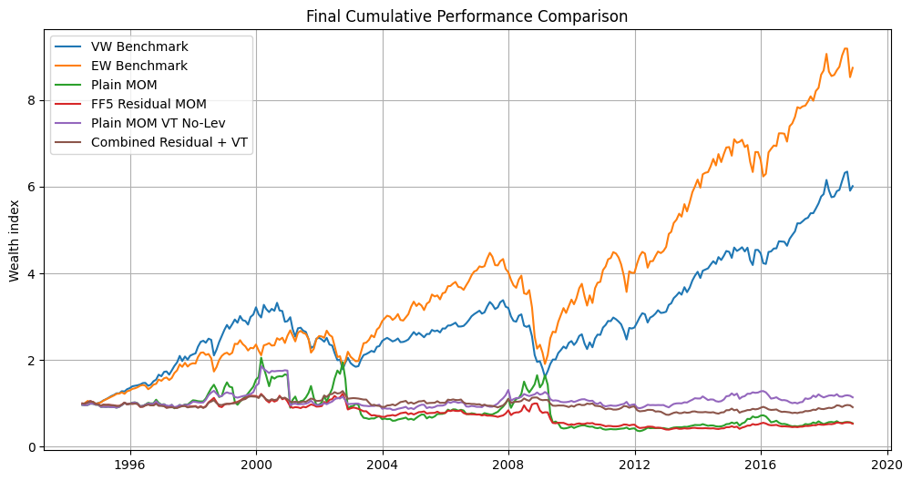
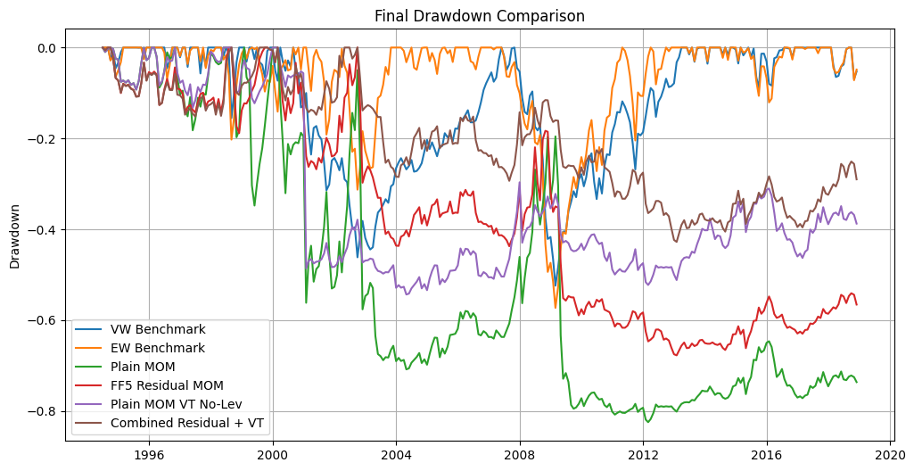
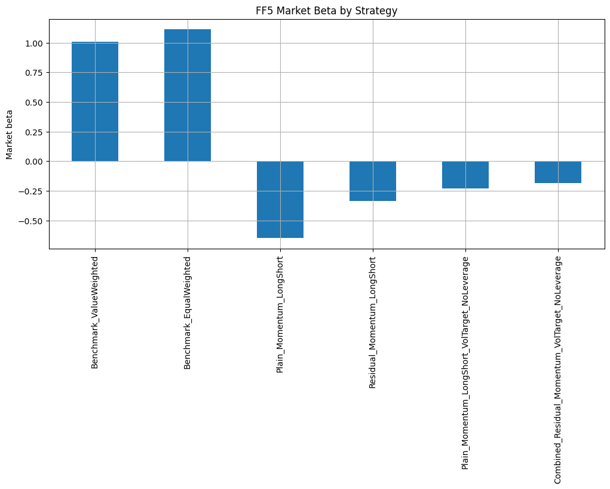
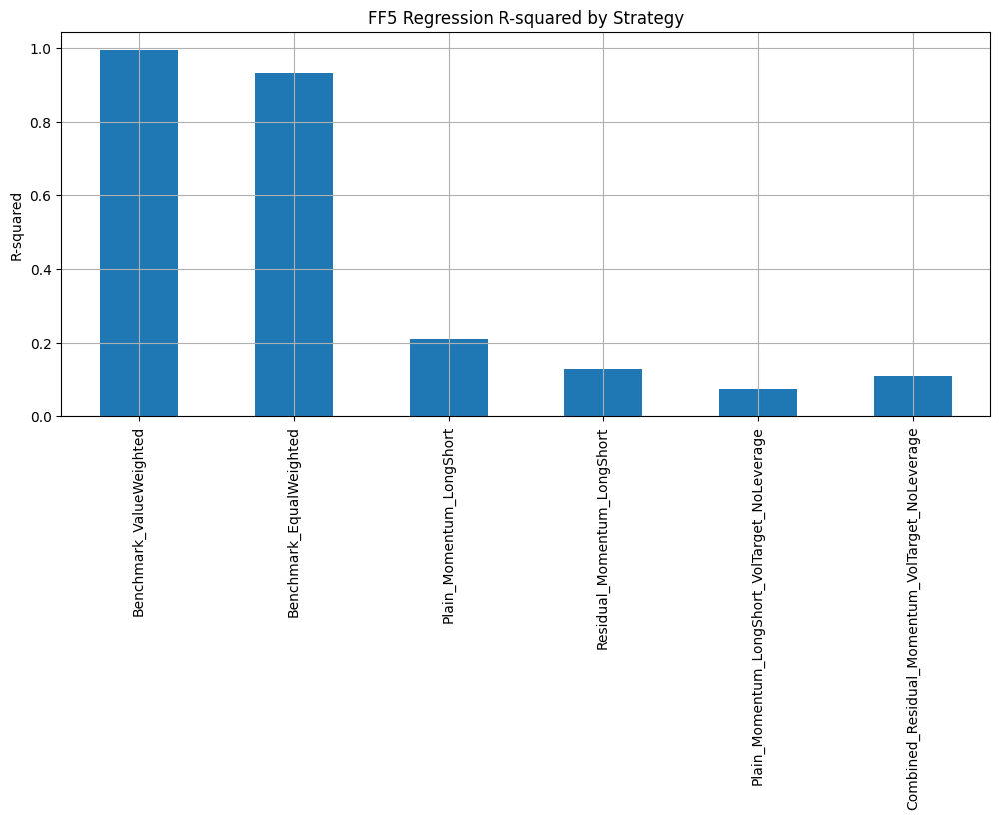

# Improving Cross-Sectional Momentum

### Residual momentum and volatility targeting on historical S&P 500 constituents

[](https://www.python.org/)
[](https://jupyter.org/)
[](https://pandas.pydata.org/)
[](https://www.statsmodels.org/)

This project asks whether two refinements can address the main weaknesses of a plain cross-sectional momentum strategy: exposure to systematic risk factors and severe losses during momentum crashes.

I start from a standard **12-1 long-short momentum strategy** and compare it with FF5 residual momentum, volatility-targeted momentum and a combined strategy. The analysis uses monthly data for historical S&P 500 constituents and defines the investable universe through lagged index weights rather than price availability alone.

> This is an academic research project, not investment advice. Results are historical and do not include transaction costs.

## Main findings

The final comparison uses the common period from **June 1994 to November 2018**, covering 294 monthly observations.

| Strategy | Ann. mean return | CAGR | Ann. volatility | Sharpe | Max drawdown | Worst month | Worst 3 months |
|---|---:|---:|---:|---:|---:|---:|---:|
| Plain momentum | 2.59% | -2.47% | 29.82% | 0.087 | -82.47% | -47.30% | -66.33% |
| FF5 residual momentum | -1.34% | -2.54% | 15.56% | -0.086 | -67.76% | -19.83% | -31.60% |
| Plain momentum + no-leverage volatility targeting | 2.04% | 0.54% | 16.21% | 0.126 | -54.36% | -45.56% | -45.32% |
| Combined residual momentum + volatility targeting | 0.17% | -0.37% | 10.44% | 0.016 | -42.79% | -9.48% | -13.14% |

The refined strategies do not clearly improve returns. Their main contribution is risk reduction:

- residual momentum reduces volatility, drawdown and exposure to common factors;
- the no-leverage volatility target improves the crash profile of plain momentum;
- the combined strategy has the lowest volatility and the mildest downside measures;
- none of the estimated FF5 alphas is statistically strong.

| Final cumulative performance | Final drawdown comparison |
|---|---|
|  |  |
| FF5 market beta | FF5 regression R-squared |
|  |  |

## Strategy design

### Plain momentum baseline

- 12-1 signal: cumulative return from month `t-12` to `t-1`, skipping the most recent month
- monthly cross-sectional ranking
- long the top decile and short the bottom decile
- equal weighting within each leg

### FF5 residual momentum

- rolling Fama-French five-factor regressions for each security
- 36-month rolling window with at least 24 observations
- residual momentum signal based on the mean and volatility of stock-specific residual returns
- the same long-short portfolio construction used for the baseline

### Volatility-targeted momentum

- 10% annual volatility target
- trailing six-month realised volatility estimate
- one-month-lagged scaling factor
- a no-leverage version caps exposure at 1.0 to avoid increasing risk after quiet periods

### Combined strategy

The final strategy applies no-leverage volatility targeting to the FF5 residual-momentum portfolio. It is designed to reduce both systematic factor exposure and crash risk.

## Data audit

The source workbook contains monthly prices and historical S&P 500 weights from December 1990 to November 2018. The initial price matrix contains 336 monthly observations and 1,355 securities.

The audit identified stale post-exit prices and historical duplicate securities. To avoid treating a forward-filled price as proof that a stock was still investable, eligibility is based on a positive lagged index weight. Duplicate securities are reported and retained at security level as a limitation of the study.

## Repository structure

```text
.
├── assets/                         # Figures extracted from the final notebook
├── notebooks/
│   └── cross_sectional_momentum.ipynb
├── presentation/
│   └── project_presentation.pptx
├── .gitignore
├── README.md
└── requirements.txt
```

The course dataset is intentionally excluded because it is not available for redistribution. The notebook is published with its outputs so that the full workflow and results can still be reviewed.

## Running the notebook

The original workflow was developed in Google Colab and reads the source workbook from Google Drive. The simplest way to reproduce it is therefore to open the notebook in Colab.

1. Obtain the course workbook containing the S&P 500 price, weight and index sheets.
2. Upload it to Google Drive.
3. Open `notebooks/cross_sectional_momentum.ipynb` in Google Colab.
4. Update the `FILE_PATH` variable so that it points to the workbook.
5. Run the notebook from top to bottom.

For a local Jupyter environment, install the dependencies with `python -m pip install -r requirements.txt`, skip the Colab-specific Drive mounting cell and replace `FILE_PATH` with a local path.

Fama-French five-factor data are downloaded during execution through `pandas-datareader`. The stored notebook outputs allow the analysis to be inspected without access to the proprietary source workbook.

## Limitations

- Results are specific to this universe, sample period and set of implementation choices.
- The analysis uses monthly S&P 500 data only.
- Historical duplicate securities are audited but not manually consolidated.
- Transaction costs, bid-ask spreads and market impact are not modelled.
- The final evidence supports improved risk control, not superior abnormal returns.

## References

- N. Jegadeesh and S. Titman, “Returns to Buying Winners and Selling Losers: Implications for Stock Market Efficiency,” *The Journal of Finance*, 1993. [Publisher page](https://onlinelibrary.wiley.com/doi/abs/10.1111/j.1540-6261.1993.tb04702.x)
- D. Blitz, J. Huij and M. Martens, “Residual Momentum,” *Journal of Empirical Finance*, 2011. [Publisher page](https://www.sciencedirect.com/science/article/abs/pii/S0927539811000041)
- P. Barroso and P. Santa-Clara, “Momentum Has Its Moments,” *Journal of Financial Economics*, 2015. [Publisher page](https://www.sciencedirect.com/science/article/abs/pii/S0304405X14002566)

## Author

**Hervé Mottaran**

Individual project developed for the **Financial Markets Analytics** course at the University of Milano-Bicocca (2025/2026).
